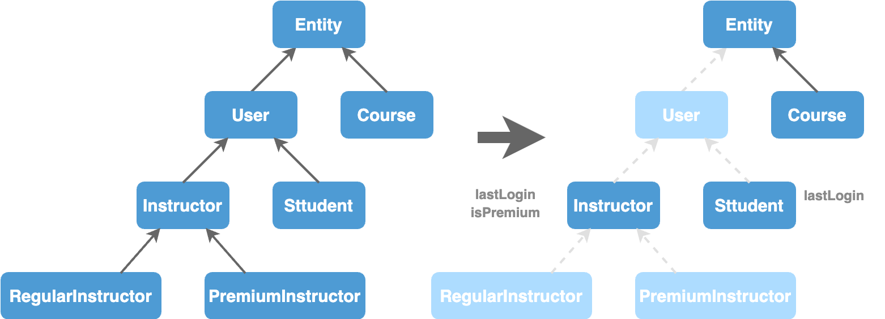

# Deep Inheritance

## Deep Inheritance

> **don't create deep inheritance hierarchies**
>
> Inheritance is good up to **`1, and 2 levels.`** Not more than 3 levels.

Classes involved in an inheritance hierarchy are **`tightly coupled`** to each other.

<figure><figcaption></figcaption></figure>

Here, Course and User classes are tightly coupled to Entity.

* If you make any changes to Entity, you have to modify Course and User classes.
  * E.g: If you change constructor of Entity class, you have to modify all the child classes.
* Even if you don't have any breaking changes, just because Entity class is changed, it has to be recompiled and redeployed.
  * That means, all these children, grand children and  other classes that depends on any of these classes will be recompiled and redeployed.
* And most of the time in deep hierarchies if you introduce field or method to base classes, it doesn't make sense to be inherited in the sub classes.
  * So you end up polluting your hierarchy with irrelevant stuff.

When you breakdown deep hierarchies it might introduce little `bit of duplication`. But then the classes will be **`decoupled`** and they can **`evolve independently`** without impacting each other.

