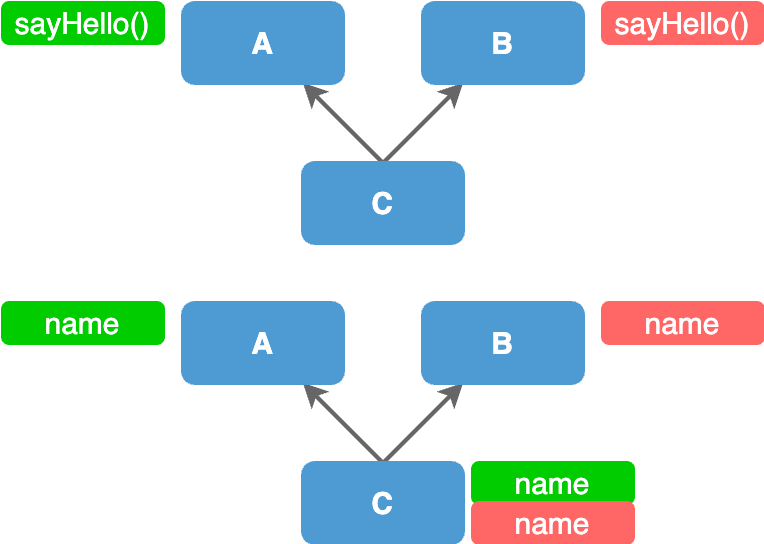
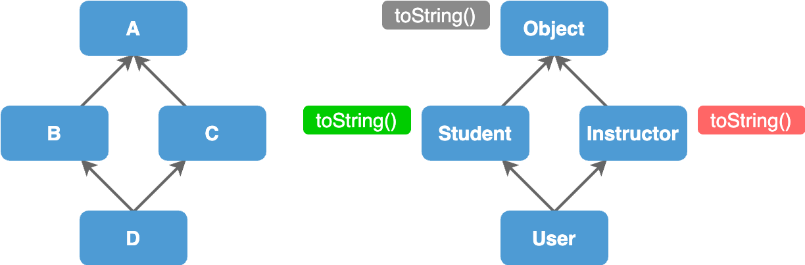

# Multiple Inheritance

## Multiple Inheritance

> Multiple Inheritance -> Class inheriting from **`multiple parents`**.
>
> Java does **`not support`** this feature due to the complexities it brings.

In some programming languages like `C++`, `Python`, a class can have multiple parents.

## Complexities Introduced with Multiple Inheritance

### 1. Ambiguity Problem

<figure><figcaption></figcaption></figure>

Say class C inherits from classes A and B both.

* If both parent classes have a method with the same signature but different implementations, it is ambiguous which implementation class C should inherit.
* If both parent classes have a field with same name, it is ambiguous whether C should inherit only one field or 2 copied of the same field.

### 2. Diamond Problem

<figure><figcaption></figcaption></figure>

Say, B and C both inherits from A. And D inherits from both B and C.

* If A has toString() method and if B and C both has implemented it differently, then it is ambiguous which implementation class C should inherit.
* In Java all classes directly or indirectly inherit from the Object class. Then if multiple inheritance is allowed in Java, it automatically runs into this diamond problem.

➡ That's why multiple inheritance is not supported in Java to keep Java simple and robust.

