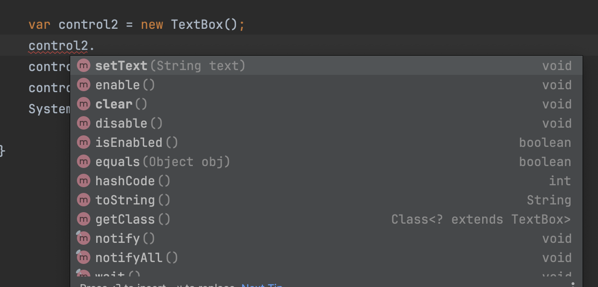

# Object Class

## Object Class

> Every class we declare in Java is directly or indirectly inherited from the **`Object`** class.
>
> declared in **`java.lang`** package
>
> We can always **`override`** all these methods inherited from Object class as necessary.

Every class we declare in Java is directly or indirectly inherited from the **`Object`** class.

* That's why every class we declare has some additional methods.

<div align="left"><figure><figcaption></figcaption></figure></div>

Since Object class is declared in java.lang package, it's available everywhere and no need to import.

<figure><figcaption></figcaption></figure>

Here, `TextBox` inherits from the `UIControl` and UIControl inherits from the `Object` class.

* Java compiler automatically adds `UIControl extends Object` for use.

```java
var box1 = new TextBox();
var box2 = box1;
System.out.println(box1.hashCode()); // Sample Output: 1975358023
System.out.println(box2.hashCode()); // Sample Output: 1975358023
System.out.println(box1.equals(box2)); // Output: true
System.out.println(box1.toString()); // Output: com.shadhini.java.tryouts.oop.inheritance.TextBox@75bd9247
System.out.println(box1.getClass()); // Output: class com.shadhini.java.tryouts.oop.inheritance.TextBox
```

## Methods of Object class

```java
var obj = new Object();
obj.getClass() 
```

-> Returns class object; With this we can find all the fields and methods defined in an object.

```java
// Sample Output: class com.shadhini.tryouts.java.java_oop.inheritance.TextBox
```

***

```java
obj.equals(Object obj) 
```

-> Used for comparing objects

* by default this compares objects based on reference equality
  * i.e this evaluates to true if both object variables refer to the same object in memory
* but this can be overridden to compare objects based on the content

***

```java
obj.hashCode()
```

-> Returns `int`; **`Hash Address`** based on the address of this object in memory.

-> Used when comparing objects for equality based on the address; hash address.


When you override `equals()`, you **must** also override `hashCode()` so that equal objects have the same hash code.


***

```java
obj.toString()
```

-> Returns string representation of an object.

-> This has 2 parts;&#x20;

1. Fully qualified name of the class that contains the package name
2. @ sign
3. Hash code represented as a hexadecimal -> compare based on hash/ memory address

```java
// Sample Output: com.shadhini.java.tryouts.oop.inheritance.TextBox@75bd9247
```

***

```java
notify()
notifyAll()
wait()
```

-> Used in concurrency.


### If we want to compare objects based on content

e.g:

If there are 2 Point objects and both these point objects has exact coordinates ➜ Then they are equal

╰┈➤ In this case we don't want to compare 2 Point objects based on hash code.

╰┈➤ We want to compare them based on content.

╰┈➤ `Then you can make use of`` `**`obj.equals()`**` ``method`&#x20;

&#x20;            `& override it to compare objects of a class based on the content.`


## How we can store primitives in Object array


[how-we-can-store-primitives-in-object-array.md](how-we-can-store-primitives-in-object-array.md)



