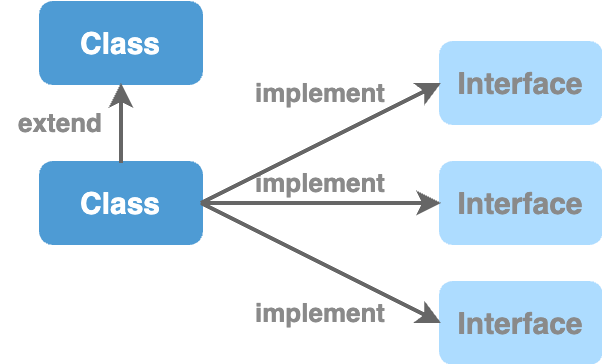

# Interfaces and Abstract Classes

## Earlier Days

|                               Interfaces                              |              Abstract Classes              |
| :-------------------------------------------------------------------: | :----------------------------------------: |
|            
[Contracts] No code, no implementation
           | \[Partially-completed/implemented Classes] |
| Use then to build loosely-coupled, extensible, testable applications. |   Used to share code between few classes   |

## Now

Now **interfaces** are used as a **hack to implement multiple inheritance**.

* Because a class can extend only 1 class, but it can implement multiple interfaces.
* Since interfaces can now have implementations, if you add implementations to an interface and a class implements several interfaces, the class will inherit implementations from multiple interfaces. ➜ This results in **`multiple inheritance`**.

<figure><figcaption></figcaption></figure>

|                                                                                                  Interfaces                                                                                                 | Abstract Classes |
| :---------------------------------------------------------------------------------------------------------------------------------------------------------------------------------------------------------: | :--------------: |
| With features that allowed to declare static, private, default methods in interfaces and since we can implement multiple interfaces, Now people abuse interfaces as a hack to realise multiple inheritance. |                  |

&#x20;
