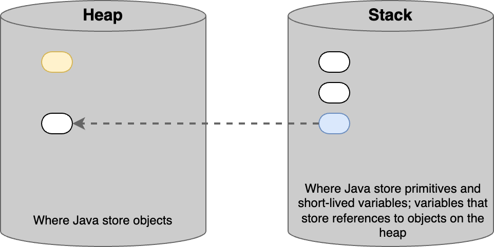
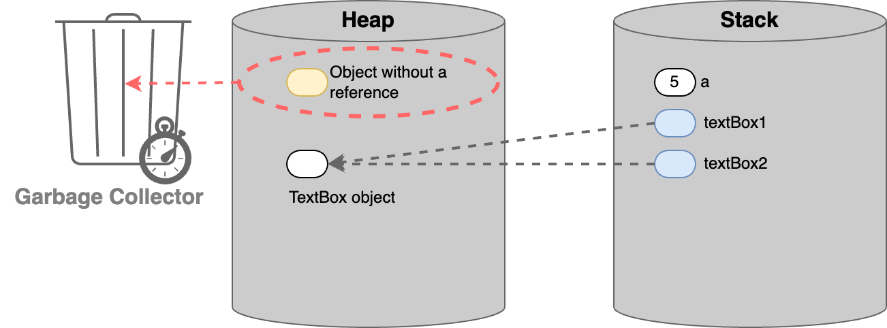

# Java Memory Management

## Java Memory Management

> **`Stack`** is used for storing primitive types and variables that store references to objects in the `heap`.&#x20;
>
> * Variables stored in the **`stack`** are immediately cleared when they go **`out of scope`** (eg when a method finishes execution).&#x20;
> * Objects stored in the **`heap`** get removed later on when there are no longer references.&#x20;
>   * This is done by Java’s garbage collector.

Java manages 2 different areas of memory.

1. Heap
2. Stack

<figure><figcaption></figcaption></figure>

## Heap

> Where Java store **`objects`**


## Stack

> Where Java store&#x20;
>
> * **`primitives`** and
> * **`short-lived variables`**; variables that store **references** to objects on the heap


## Memory Allocation Process

<pre class="language-java"><code class="lang-java"><a data-footnote-ref href="#user-content-fn-1">var textBox1</a> = <a data-footnote-ref href="#user-content-fn-2">new TextBox()</a>;
</code></pre>

* When Java runtime execute above line, it'll evaluate the right side of the assignment (❶ RHS).
* It'll create a new `TextBox` object and will store it on the **`heap`**.
* Say, the address of this object on the heap is `100`.
* Then Java runtime executes the left side of the assignment (❷ LHS) and it will allocate some memory on **`stack`**.
* And in this memory location, it will store the address of the TextBox object on the heap.
* So `textBox1` variable is referencing an object on the heap.
* That's why we refer to these variables as **`reference types`** as these variables don't store the actual values.


* If we declare an `integer`, that variable is stored on the **`stack`** and the value that we have in that variable will be stored in that memory location.


```java
int a = 5;
var textBox1 = new TextBox();
var textBox2 = textBox1;
```

<figure><figcaption></figcaption></figure>

Here,

* Both `textBox1` and `textBox2` variables on the stack are referencing to same TextBox object on the heap.
* If we modify this object through one of the variables, the changes would be visible through the other variable.


## Memory Deallocation Process

In Java, unlike in C++, we don't have to worry about deallocating memory. Java will automatically take care of that.

How it works .....

* When we **`exit a method`**, Java runtime will **immediately** **remove** all the variables that are stores on the **`stack`**.
* Then only the objects in the **`heap`** will **remain**.


```java
public static void main(String[] args) {
    int a = 5;
    var textBox1 = new TextBox();
    var textBox2 = textBox1;
}
```

<figure><figcaption></figcaption></figure>

Here,&#x20;

* All `a`, `textBox1`,  and `textBox2` variables on the stack will be immediately removed after the method execution is finished.
* And then, we'll be left with only the `TextBox object` on the heap.
* But, there will be no reference to the object in the heap which was created by the method which just finished the execution.


* There's another process in the background, which is watching these objects on the heap.
* If an object becomes **`unused`** for a certain period of time, that process is going to automatically remove that object on the heap.

&#x20;     ╰┈➤ This is called **`Garbage Collection`**.

* `Java Runtime` has the garbage collection component which will automatically remove **`unused`** objects on the **`heap`**.


## Example




[^1]: ❷ LHS

[^2]: ❶ RHS
