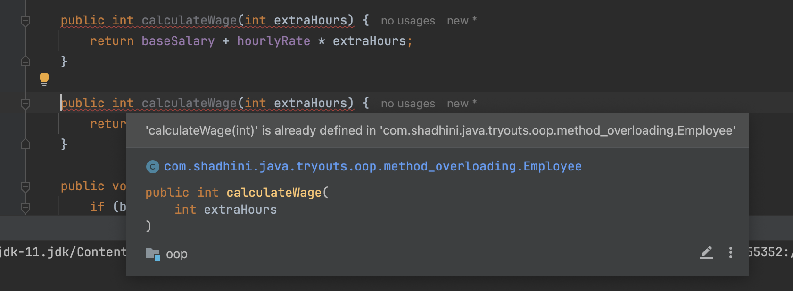

# Method Overloading

> Declaring a method multiple times with different method signatures.
>
> ➡️ **Same method name**
>
> **➡️ Different number/types and order of parameters**

## Default Values for Method Parameters

In languages like Python, C#, we can set default values for parameters.

* So there, if you wanna avoid sending some arguments only in some cases, then instead of overloading, you can set default values for those parameters in the method declaration.
* Then, if this method is called without a specific argument and if that parameter has a default value set, the method will run with that default value.

╰┈➤ But, this is `not possible in Java`.

## Best Practice

Overloading a method too many times will make the application hard to maintain.&#x20;

* Because you'd end up with so many variations and these method will be calling each other.

&#x20; ╰┈➤  `Overloading a method too many times is ugly.`&#x20;

In professional coding, if the gain of method overloading is tiny, then better to not go for it.

╰┈➤  `Don't over use method overloading.`&#x20;

But overloading is necessary if you are dealing with completely different types of parameters.

* e.g:&#x20;
  * One implementation take 2 integers as parameters
  * Other implementation takes `Employee` object as parameter

╰┈➤  `Method overloading is necessary if parameters are of different types.`&#x20;

## Example





<figure><figcaption></figcaption></figure>

## Constructor Overloading


[constructor-overloading.md](constructor-overloading.md)


<table data-view="cards"><thead><tr><th></th><th data-hidden data-card-target data-type="content-ref"></th></tr></thead><tbody><tr><td><strong>Constructor Overloading</strong></td><td><a href="constructor-overloading.md">constructor-overloading.md</a></td></tr></tbody></table>

