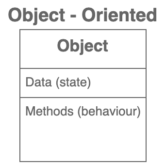

# OOP: Object Oriented Programming

<figure><figcaption></figcaption></figure>

Everything based on the concept of `objects`.

**`Objects`** contain

1. **`Data`**` ``(state)`
2. **`Methods`**` ``(behaviour)`; operations on the data; functions that modify data; Methods change the state of an object.

In object oriented programming, we bring together data and methods that operate on a single object.

***

In OOP, objects interact with each other to perform tasks.

&#x20;  e.g: car&#x20;

* Car has many collaborating objects inside it.
* Almost all of these objects are **`replaceable`** and **`reusable`**.
* If any of them malfunction, technician can replace it with another.

&#x20;  ➯ Application in OOP is like a car.


[benefits-of-object-oriented-programming.md](benefits-of-object-oriented-programming.md)


