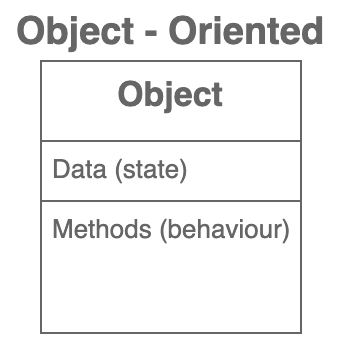
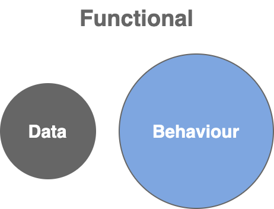

# Object Oriented vs Function

You can solve a problem using both paradigms.

╰┈➤ your code will look different.

<table data-header-hidden><thead><tr><th width="271"></th><th></th></tr></thead><tbody><tr><td></td><td></td></tr></tbody></table>

## Object Oriented Programming or Functional?

> **No paradigm works best in all situations**.
>
> ╰┈➤  depends on the **problem** you are trying to solve, it's **context** and **budget**.

In a **`single application`**, you can use **`multiple paradigms`**.

&#x20;      e.g:  event-driven in one part

&#x20;              functional/ object oriented on other parts

### Basic guideline -- No hard & fast rule

OOP &#x20;

╰┈➤ better choice for creating graphical user interfaces and games

Functional&#x20;

╰┈➤ Makes more sense for applications that require

&#x20;           ⤷ high level of reliability or

&#x20;           ⤷ problems that involve messages being passed around and getting transformed along the way.

