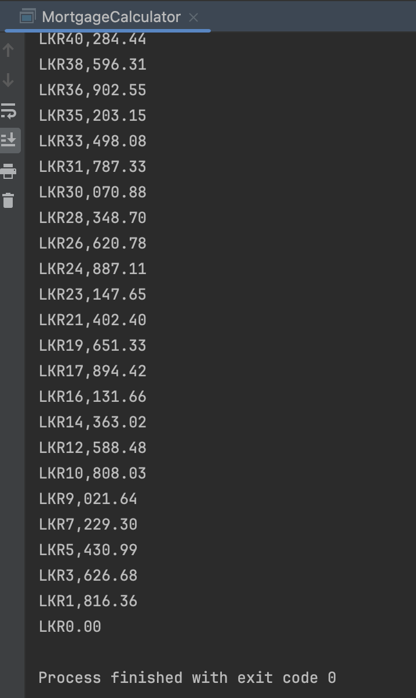

# Refactoring Towards an Object Oriented Design

\[`Recommended`] ✅ Use an IDE  for refactoring instead of manual refactoring.

What are the classes?

* Make sure each class has a single responsibility.

ℹ️ `Constructors` are used to initialise instances.

ℹ️ `Static members` are used only when we need a single instance.

ℹ️ `Final variables` -> cannot change once set

✅ Move all the getters and setters to the bottom of the class.

✅ Keep everything that's not needed outside as private members.

## E.g: Mortgage Calculator

<figure><figcaption></figcaption></figure> <figure><figcaption></figcaption></figure>









