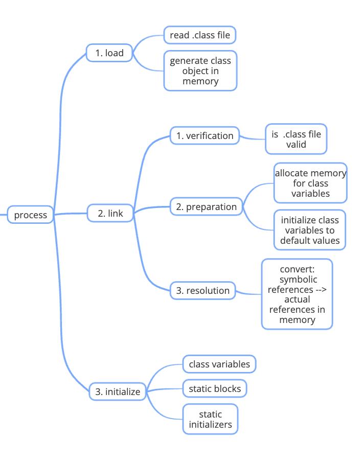
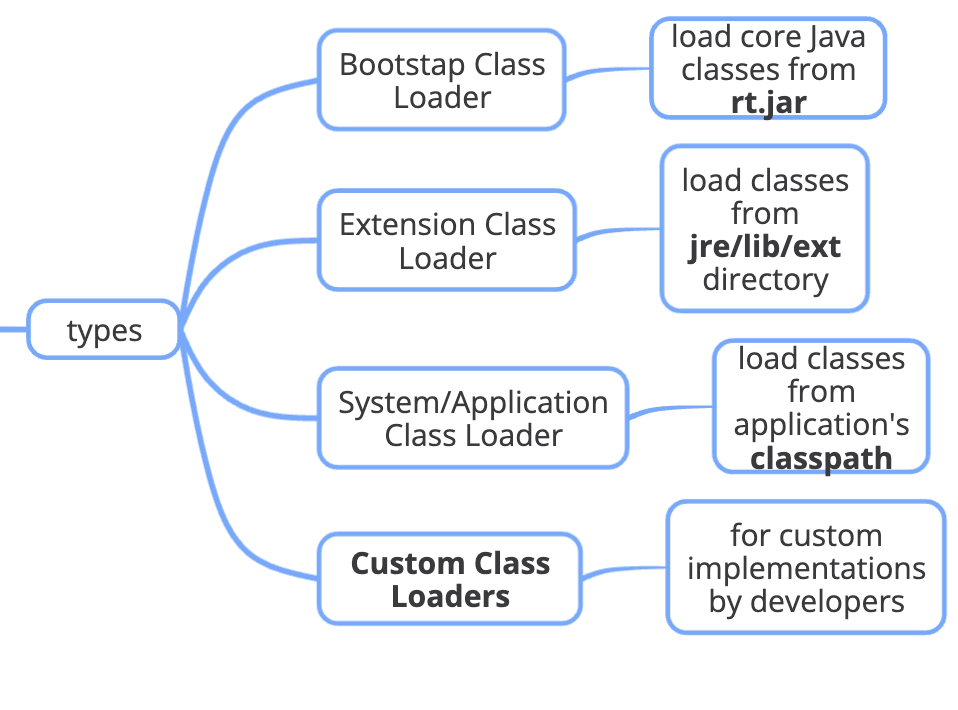

# Java Class Loading


`ClassLoader` dynamically loads Java classes into the JVM

* ClassLoader is part of the JRE (Java Runtime Environment)


## **Class Loading Process**:

<figure><figcaption></figcaption></figure>

1. **Loading**:
   * `ClassLoader`&#x20;
     1. reads the _**.class**_ file &#x20;
     2. generates a Class object in memory
2. **Linking**:&#x20;
   1. **Verification**: Ensures the .class file is valid and adheres to the Java specification.
   2. **Preparation**: Allocates memory for class variables and initializes them to default values.
   3. **Resolution**: Converts symbolic references to actual references in memory.
3. **Initialization**:&#x20;
   * The JVM&#x20;
     1. initializes class variables with their defined values &#x20;
     2. executes static initializers and static blocks

## **Types of Class Loaders**:

<figure><figcaption></figcaption></figure>

* **Bootstrap Class Loader**: Loads core Java classes from the `rt.jar` file (e.g., classes in `java.lang`, `java.util`).
* **Extension Class Loader**: Loads classes from the `jre/lib/ext` directory.
* **System/Application Class Loader**: Loads classes from the application's classpath.
* **Custom Class Loaders**: Developers can create custom class loaders to load classes in specific ways or from specific sources.

