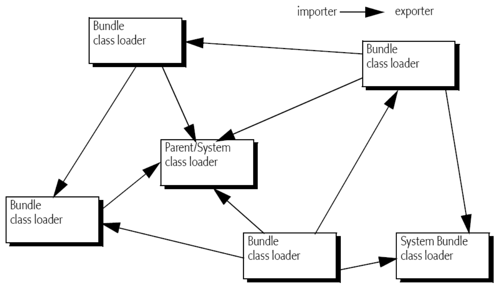
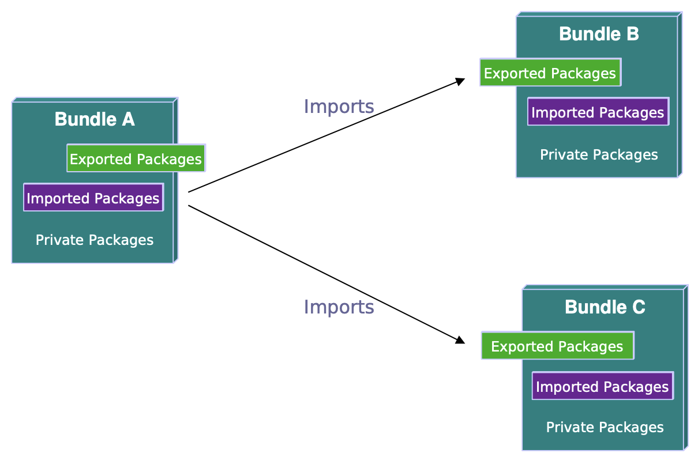
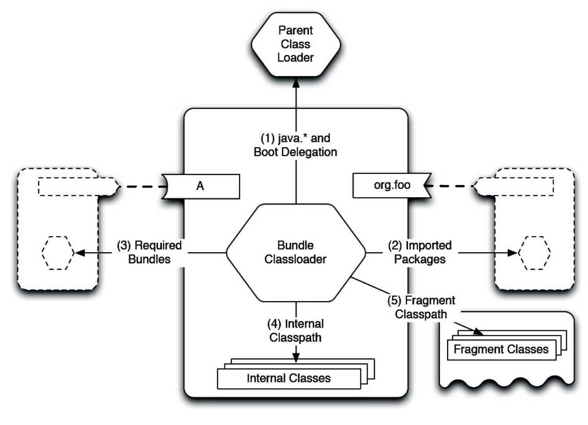
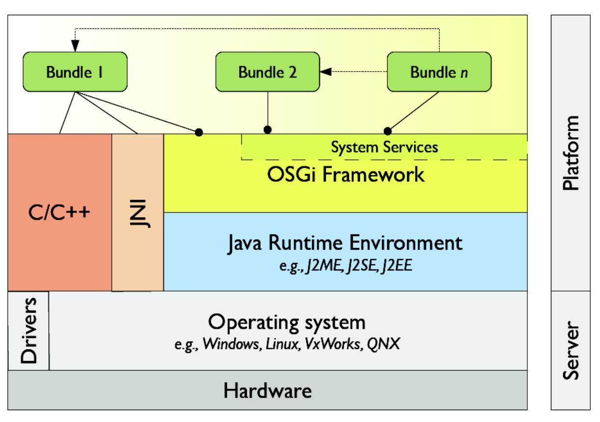
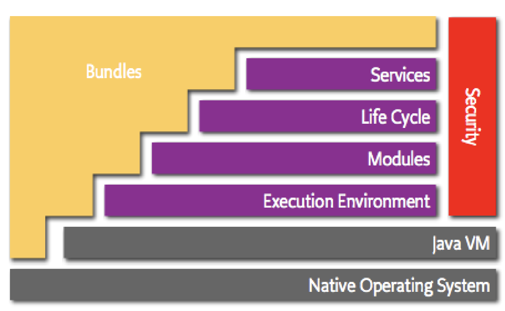
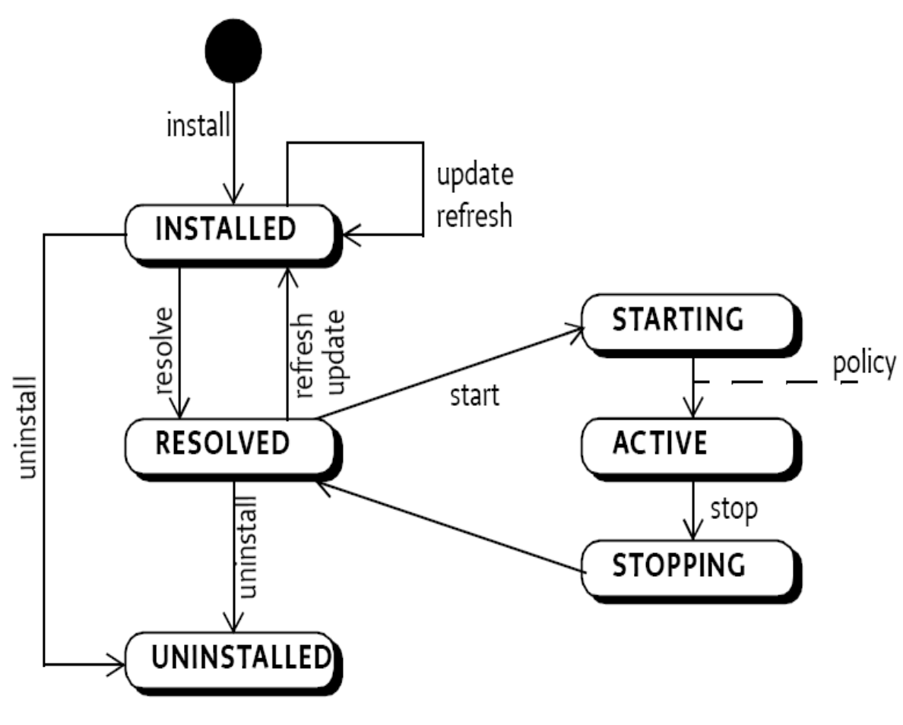

# OSGI

> **`OSGI`**: **Open Service Gateway initiative**:
>
> The Dynamic Module System for Java: a framework for modular development and deployment of Java application


OSGI allows applications to be composed of multiple, reusable modules (**bundles**) that can be **dynamically** installed, started, stopped, and updated without restarting the entire application.



Standard Java application is a collection of JARs.

OSGI based application is a collection of OSGI bundles.


## **Characteristics/Features of OSGi**

1. **Modularity**:
   * Applications are divided into `bundles`, which are **JAR files with additional metadata**.
   * Each bundle can be independently developed, tested, and deployed.
2. **Lifecycle Management**:
   * OSGi provides a lifecycle for bundles, allowing them to be installed, started, stopped, updated, and uninstalled at runtime.
3. **Service Registry**:
   * Bundles can **register and discover services** in a dynamic, loosely-coupled manner.
   * Promotes a service-oriented architecture.
   * `The System Bundle`
     * OSGi Core framework implementation classes reside in the system bundle.&#x20;
     * Registers system services.&#x20;
     * Exports packages that are loaded from the system classpath
4.  **Class Loading**:

    * Each bundle has **its own class loader**, which prevents classpath conflicts and allows multiple versions of the same library to coexist.
      * Bundle class loader can load classes from&#x20;
        * system class loader&#x20;
        * other bundle class loaders (imported packages)&#x20;
        * the bundle's jar file

    <figure><figcaption><p>Bundles &#x26; Class Loaders</p></figcaption></figure>
5. **Manifest File**:
   * Contains additional OSGi-specific headers, such as `Bundle-SymbolicName`, `Bundle-Version`, `Import-Package`, and `Export-Package`.
     * `Bundle-SymbolicName`: to uniquely identify a bundle


### **Example Structure of OSGI Bundle**

```
mybundle.jar
├── META-INF/
│   └── MANIFEST.MF
├── com/
│   └── example/
│       └── MyService.class
└── resources/
    └── config.properties
```

Example `MANIFEST.MF`:

```
Bundle-ManifestVersion: 2
Bundle-Name: My Bundle
Bundle-SymbolicName: com.example.mybundle
Bundle-Version: 1.0.0
Import-Package: org.osgi.framework
Export-Package: com.example.mybundle
```


## OSGI Bundles & Java Packages

* By default, **packages** in a Bundle are considered as **private**. Other bundles cannot see them.&#x20;
* If a bundle needs to **share packages**, it needs to **explicitly export packages** using the manifest header `Export-Package`.&#x20;
* The way to use classes/packages in other bundles is to **import** them explicitly using `Import-Package` manifest header.

```
# MANIFEST.MF file header
Import-Package: org.osgi.framework
Export-Package: com.example.mybundle
```

<figure><figcaption><p>Bundles &#x26; Java Packages</p></figcaption></figure>


## OSGI Bundle Headers

* `Export-Package`: to share packages to other bundles
* `Import-Package`: to use classes/packages in other bundles&#x20;
  * allows specifying version ranges for packages
* `Require-­Bundle`: to directly wire bundle to other bundles
  * allows to import all exported packages from another bundle
  * **use** of Require-Bundle is strongly **discouraged**
* `Bundle-Activator`: fully qualified class name of the class which implements the BundleActivator interface

```
# MANIFEST.MF file header
Bundle-ManifestVersion: 2
Bundle-Name: My Bundle
Bundle­-SymbolicName: com.example.mybundle
Bundle-Version: 1.0.0
Require­-Bundle: com.example.sample−api;visibility=reexport
Import-Package: org.osgi.framework
Export-Package: com.example.mybundle
Bundle­-Activator: org.sample.Activator 
```


#### Reasons to Avoid `Require-Bundle` in OSGi

1. **Tight Coupling**:
   * Creates direct dependencies between bundles, reducing flexibility and maintainability.
   * **Preferred Approach**: Use `Import-Package` to depend on specific packages, promoting loose coupling and modularity.
2. **Versioning Issues**:
   * Handles versioning poorly, leading to potential conflicts if different versions are needed by different parts of the application.
   * **Preferred Approach**: `Import-Package` allows specifying version ranges for packages, offering better control over dependencies.
3. **Classpath Conflicts**:
   * Exposes all packages of the required bundle, leading to possible overlaps and conflicts.
   * **Preferred Approach**: `Import-Package` lets you selectively import only needed packages, minimizing conflicts.
4. **Reduced Modularity**:
   * Forces bundles to be aware of each other, against OSGi's modularity principles.
   * **Preferred Approach**: `Import-Package` encourages modularity by allowing dependencies on specific packages and services.
5. **Split Packages**:
   * Classes from the same package can come from different bundles, leading to split packages.
   * **Issues**:
     * Bundle A requires Bundle B, which can change over time.
     * Bundle B may stop exporting certain packages, affecting Bundle A.
     * Bundle B might be split into several bundles.
     * Require-bundles chain can occur (e.g., Bundle A -> Bundle B -> Bundle C -> Bundle D).
     * Bundle A may depend on a small portion of Bundle B but has to include all bundles in the chain.
     * Results in bringing in a large amount of functionality when only a small amount is needed.


## Fragment Bundles

* Fragments are bundles that are **attached to a host bundle by the framework.**&#x20;
* Fragments are treated as **part of the host**, including any permitted headers.&#x20;
* All class or resource loading of a fragment is handled through the host s class ’ loader, a fragment must **never have its own class loader**.&#x20;
* `Fragment-Host` manifest header is used to specify the host bundle of the fragment bundle&#x20;

```
Bundle-­SymbolicName: child­-bundle 
Fragment-­Host: parent-­bundle
```

#### Usage:

1. to provide translation files for different locales
2. to provide some platform specify code.


## Runtime Class Loading

<figure><figcaption></figcaption></figure>


## Java & OSGI Architecture

<figure><figcaption></figcaption></figure>


## OSGI Layering

<figure><figcaption></figcaption></figure>


## Bundle States

<figure><figcaption></figcaption></figure>

* `INSTALLED`:&#x20;
* `RESOLVED`: all Java classes that the bundle needs are available.&#x20;
  * bundle is either ready to be started or has stopped.&#x20;
* `STARTING`:&#x20;
  * BundleActivator.start method is called, and this method has not yet returned&#x20;
* `ACTIVE`: bundle is activated and running;
  * BundleActivator.start method has been called and returned
* `STOPPING`:&#x20;
  * BundleActivator.stop method has been called but the stop method has not yet returned&#x20;
* `UNINSTALLED`: bundle cannot move into another state


## Bundle Activator

Bundle is activated by calling its Bundle Activator object(if any).&#x20;

```java
// BundleActivator Interface to be implemented
Public interface BundleActivator { 
    public void start(BundleContext context) throws Exception; 
    public void stop(BundleContext context) throws Excecption; 
}
```


## Bundle Context&#x20;

Represents the **execution context of a single bundle within the OSGi platform**.&#x20;

* Act as a proxy between to the underlying framework.&#x20;
* `BundleContext` object is created by the framework when a bundle is started.&#x20;
* `BundleContext` object can be used to,&#x20;
  * Install new bundles&#x20;
  * Obtain registered services by other bundles
  * Register services in the framework.&#x20;
  * Subscribe or unsubscribe to events broadcast by the Framework

