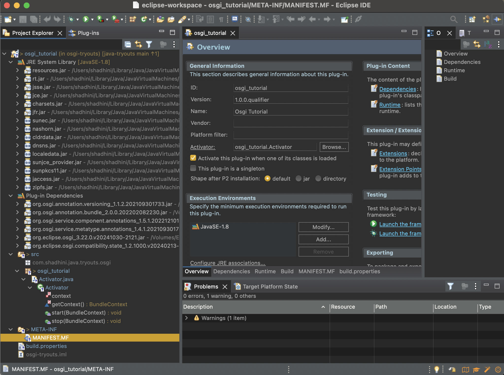
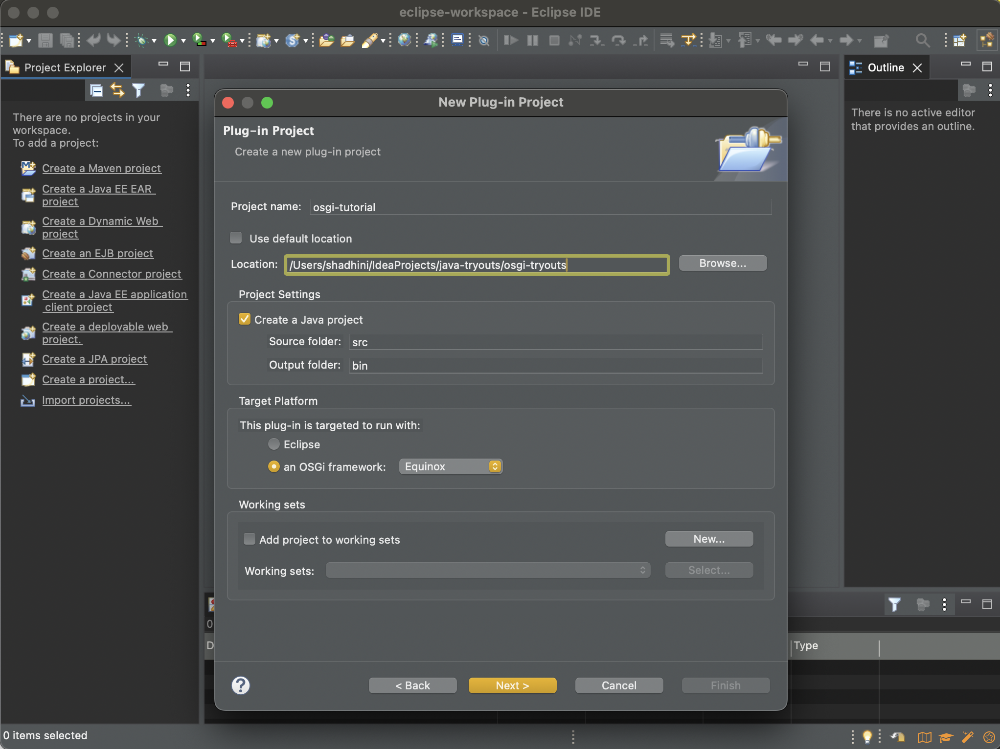

# OSGI Development

## OSGi Frameworks <a href="#e026" id="e026"></a>

Several independently implemented OSGi frameworks are available today, including four open-source options:

1. **Equinox**
2. **Knopflerfish**
3. **Felix**
4. **Concierge**


## OSGi Development Tools <a href="#id-7e5b" id="id-7e5b"></a>

* **Basic Tools**: Standard Java tools like `javac`, `jar`, and a text editor for **MANIFEST.MF**.
* **Practical Tools**:
  * **Build Tools**: Ant, Maven
  * **IDEs**: Eclipse, NetBeans, IntelliJ
* **Reason**: Basic tools are laborious and require a lot of effort, hence the use of advanced tools for efficiency.

\


## Hands On with **Equinox, Eclipse IDE**  <a href="#id-9a50" id="id-9a50"></a>

<figure><figcaption></figcaption></figure>

@Eclipse IDE

1. `New` → `Project` → `Plug-in Project`
2.  Give a project name and select `Equinox` as the OSGi framework.

    <figure><figcaption></figcaption></figure>
3. `Next`
   1. `Execution Environment`: select the Java version you installed into your computer
   2. And select the checkbox for _`generate an activator`_.&#x20;
   3. `Finish`
4. rename  `src` /`osgi_tutorial` / `Activator.java` to `HelloWorldActivator.java`
   1. change name in MANIFEST.MF too
5. Right click on project from left pane and  `Run As` → `OSGi Framework`
6.  After many errors on `Console` tab, you'll see `osgi>` prompt

    1. type `ss` --> to see all the bundles that are running in the project
       1. `OSGi_Tutotial_1.0.0.qualifier` is there with the id&#x20;
    2.  Now you can simply stop this by typing `stop <ID>` and start it again by typing `start <ID>` in the `osgi` console

        ```bash
        osgi> stop 1006
        Goodbye, World!

        osgi> 
        osgi> start 1006
        Hello, World!
        ```


/osgi\_tutorial/src/osgi\_tutorial/HelloWorldActivator.java

```java
package osgi_tutorial;

import org.osgi.framework.BundleActivator;
import org.osgi.framework.BundleContext;

public class HelloWorldActivator implements BundleActivator {

	private static BundleContext context;

	static BundleContext getContext() {
		return context;
	}

	public void start(BundleContext bundleContext) throws Exception {
		System.out.println("Hello, World!");
	}

	public void stop(BundleContext bundleContext) throws Exception {
		System.out.println("Goodbye, World!");
	}

}

```

/osgi\_tutorial/META-INF/MANIFEST.MF

```
Manifest-Version: 1.0
Bundle-ManifestVersion: 2
Bundle-Name: Osgi Tutorial
Bundle-SymbolicName: osgi_tutorial
Bundle-Version: 1.0.0.qualifier
Bundle-Activator: osgi_tutorial.HelloWorldActivator
Bundle-RequiredExecutionEnvironment: JavaSE-1.8
Automatic-Module-Name: osgi.tutorial
Import-Package: org.osgi.framework;version="1.3.0"
Bundle-ActivationPolicy: lazy
```


## HandsOn with Maven and IntelliJ

[https://github.com/shadhini/java-tryouts/tree/main/osgi-tryouts/book-inventory](https://github.com/shadhini/java-tryouts/tree/main/osgi-tryouts/book-inventory)


## OSGi Commands <a href="#fafa" id="fafa"></a>

* `ss` → list down the bundles in the server with bundle id
* `ss <NAME>` → search the given name in the bundle and list it out
* `ls` → list down services
* `b <ID>` → show bundle info
* `diag <ID>` → show unsatisfied constraints of the bundle
* `start <ID>` → start a bundle
* `stop <ID>` → stop a bundle
