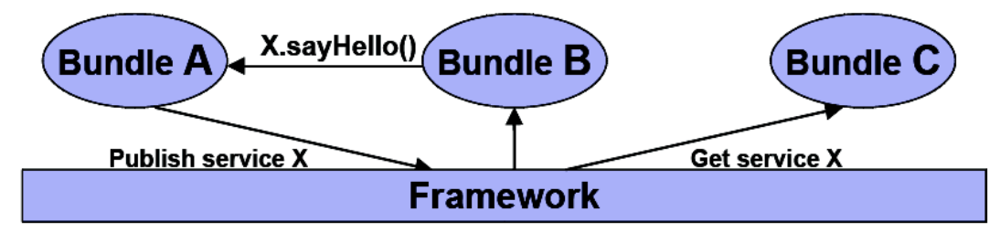
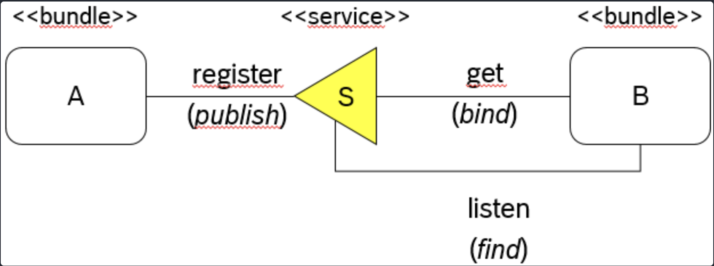

# Service Layer

Service Layer: Specifies a mechanism for bundles to collaborate at runtime by sharing objects.

* OSGi provides a **in-VM** **publish-find-bind** model for plain old Java objects(**`POJO`**).

<figure><figcaption></figcaption></figure>

> **Service**:
>
> Java object published in the OSGI framework **service registry**


## Publish Find Bind Model

<figure><figcaption></figcaption></figure>

🌟 Bundles **register** (**`publish`**) services

🌟 Bundles **get** (**`bind`**) services

🌟 Bundles **listen** (**`find`**) services

* listens to the changes to the services&#x20;
  * gets notified when new services comes up, and if services goes down&#x20;


## Registering a Service

* Bundles can register Java objects(services) with this service registry under one or more interfaces.&#x20;


Using a Java interface as the type of the service is strongly recommended


<pre class="language-java"><code class="lang-java">public class Activator implements BundleActivator {
    public void start(BundleContext bc) {
        Hashtable props = new Hashtable();
        props.put("language", "en");
        
        //Registering the HelloWorld service
<strong>        bc.registerService(HelloService.class.getName(), 
</strong>                new HelloServiceImpl(), props); 
    }
    
    public void stop(BundleContext bc) {
    }
}
</code></pre>


## Using a Service

* Use framework to find a `ServiceReference` for the actual service
* Use `ServiceReference` to **`get`** the service object
* If you do not need the service anymore, use `ServiceReference` to **`unget`** the service object.

```java
public void start(BundleContext bc) {
    //Get the service reference for HelloService
    serviceRef = bc.getServiceReference(HelloService.class.getName());
    
    //service reference can be null, if the service is not registered.
    if(serviceRef != null) {
        helloService = (HelloService)bc.getService(serviceRef); 
    } else {
        System.err.println("service reference not found.");
    }
    
    //service can be null..
    if (helloService!=null) {
        helloService.sayHello(); 
    } else {
        System.err.println("No HelloService found!");
    }
}
```


Once the bundle finished utilizing the service, It should **release service**.

```java
public void stop(BundleContext bc) {
    if (helloService!=null) {
        bc.ungetService(serviceRef);
        helloService = null;
        serviceRef = null;
    } else {
        System.err.println("HelloService is null!");
    }
}
```


## Stale References

> **Stale reference**:
>
> reference to a Java object that
>
> * belongs to the class loader of a **bundle** that is **stopped**
> * is associated with a service object that is **unregistered**



Stale reference are **potentially harmful** because they may result in significantly **increased memory usage**.



Bundle developers must **remove stale references** and **listen to service events** to act accordingly.


\


## Events and Listeners

* Framework fires `ServiceEvents` for following actions related to services.
  * **Registering** a service.&#x20;
  * **Unregistering** a service.&#x20;
  * **Modifying** service properties.&#x20;



It is highly recommended for bundles which uses services, to **listen to these events** and carefully handle them.



